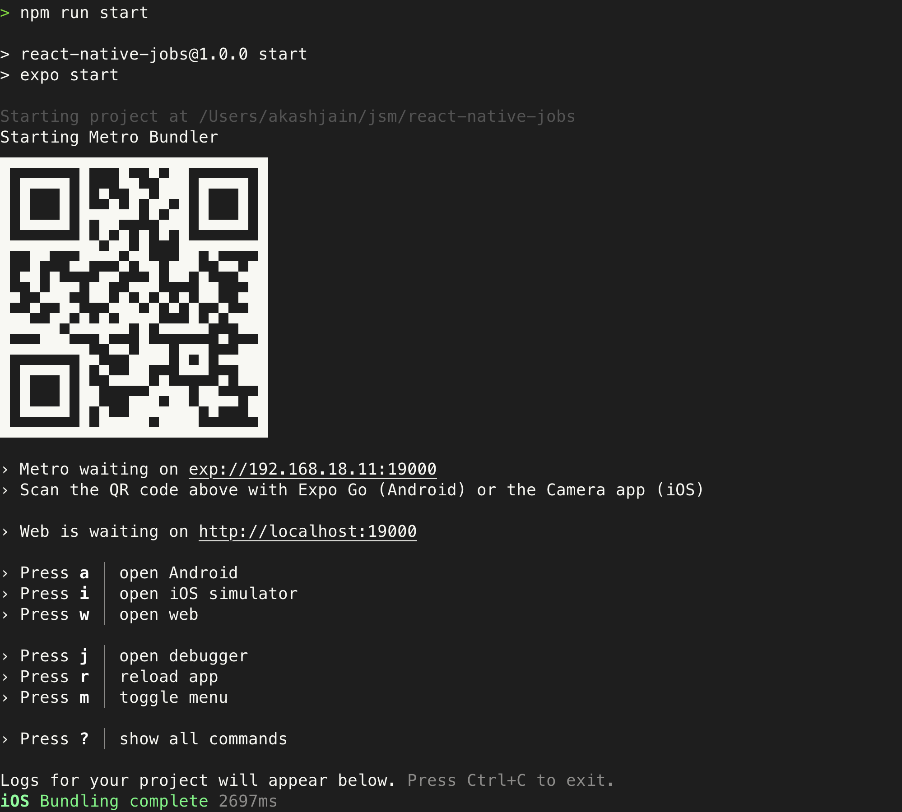

## React Native Project created using `expo-router`

- [Expo Router: Docs](https://expo.github.io/router)
- [Expo Router: Repo](https://github.com/expo/router)
- [Request for Comments](https://github.com/expo/router/discussions/1)

## 🚀 Installation

- Clone the repo
- Install dependencies: `npm install`
- Start expo server: `npm run start`
- Download Expo Go app: https://apps.apple.com/us/app/expo-go/id982107779
- Open the Camera and scan the QR
  
- Open the app on the Phone

## License

This project is licensed under the MIT License.

